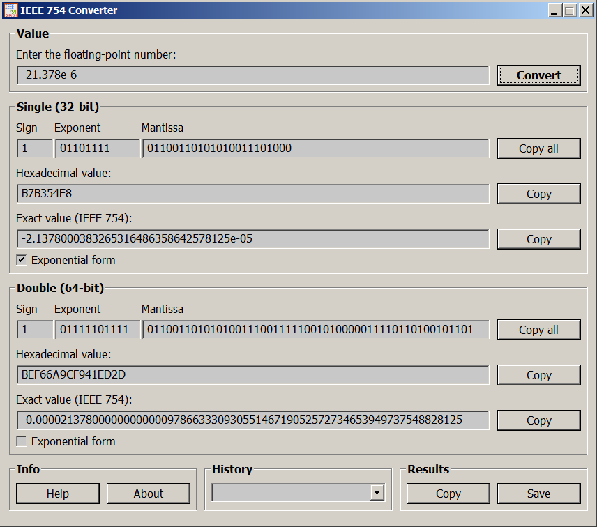

# IEEE754-Converter
A simple C++ program using pure WinAPI to compute various representations of single- and double-precision floating-point numbers based on IEEE-754 standard.

You can download the compiled file `ieee754_converter_x64.exe` and `ieee754_converter_x32.exe` on the [release page](https://github.com/ap13ski/IEEE754-Converter/releases/tag/release). 

Compilers: [MinGW-W64 v.8.1.0](https://sourceforge.net/projects/mingw/) (64-bit), [TDM-GCC 9.2.0](https://sourceforge.net/projects/tdm-gcc/) (32-bit).

Tested on MS Windows: XP (32-bit only), 7, 10, 11.

