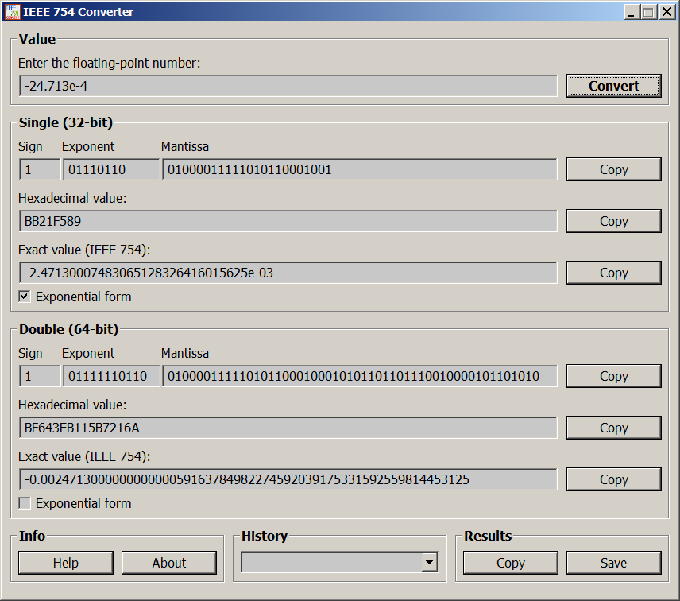

# IEEE754-Converter
A pure WinAPI C++ program for generating various representations of floating-point numbers based on [IEEE 754](https://andrewt0301.github.io/hse-acos-course/part1ca/07_FP/ieee-754-2008.pdf) standard. 

You can download the compiled files `ieee754_converter_x32.exe` and `ieee754_converter_x64.exe` on the [release page](https://github.com/ap13ski/IEEE754-Converter/releases/tag/release). 

Compilers: [TDM-GCC 9.2.0](https://jmeubank.github.io/tdm-gcc/) (32-bit), [MinGW-W64 v.12.0.0](https://www.mingw-w64.org) (64-bit).

Tested on MS Windows: XP (32-bit only), 7, 10, 11.

